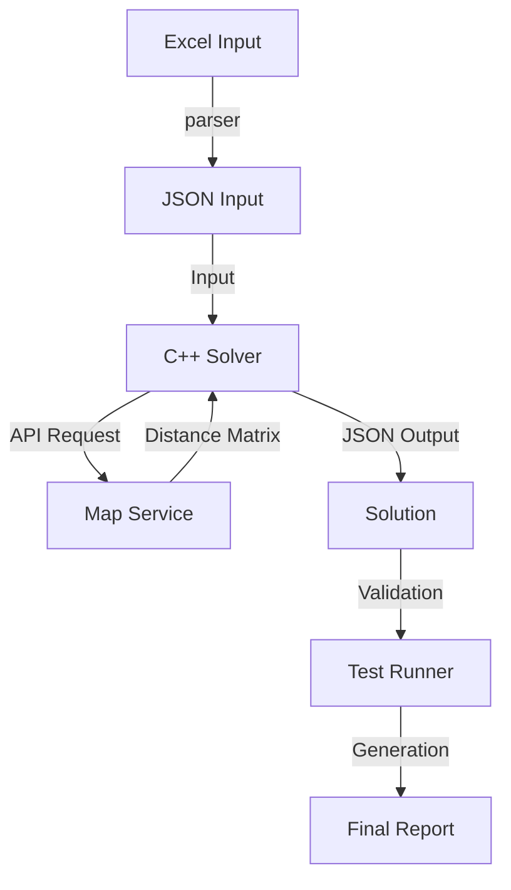

# System Architecture

## Overview
Velora Mobility Optimizer is a high-performance Vehicle Routing Problem (VRP) solver designed for employee transport optimization. It processes employee requests, vehicle availability, and constraints to generate optimal route plans. The system is built with a decoupled architecture using Python for data handling and C++17 for computationally intensive optimization.

## System Components

### 1. Data Pipeline & Parser
- **Input**: Excel files (`.xlsx` or `.csv`) containing Employee Requests and Vehicle Data.
- **Module**: `parser/excel_to_json.py`
- **Output**: JSON intermediate format.
- **Responsibility**: validating raw data, schema compliance, and normalization.

### 2. Optimization Engine (Solver)
The core engine is a C++ application located in `solver/`.
- **Constraint Checker (`solver/src/constraints/`)**: 
    - Validates all Hard and Soft constraints.
    - Handles "Forced Assignments" for infeasible requests (e.g., Priority 1 employee running late).
- **Cost Function (`solver/src/cost/`)**: 
    - Evaluates solution quality based on Total Distance, Travel Time, and Penalties.
- **Map Service (`solver/src/map_distance.cpp`)**: 
    - Interfaces with external Mapping API (OSRM/Google).
    - **Circuit Breaker**: Implements a strict 100ms timeout. If the API fails or lags, it automatically switches to Haversine (Great Circle) distance for reliability.
- **Heuristic Core (`solver/src/main.cpp`)**: 
    - Implements the Hybrid Constructive + Simulated Annealing algorithm.

### 3. Execution & Reporting
- **Runner**: `scripts/test_runner.py`
- **Function**: Orchestrates the build, execution, and reporting.
- **Output**: 
    - JSON Solution files.
    - Human-readable text reports.
    - Infeasibility warnings and Constraint Violation logs.

## Constraints & Requirements

### Hard Constraints (Must not be violated)
1. **Vehicle Capacity**: Number of passengers cannot exceed vehicle capacity.
2. **Sharing Limits**: Female employees may have sharing constraints (e.g., safe travel). (Implemented via `sharingLimit` parameter).

### Soft Constraints (Relaxable with Penalty)
1. **Time Windows & Tolerances** (Defined by Priority):
    - **P1**: Max 5 mins delay.
    - **P2**: Max 10 mins delay.
    - **P3**: Max 15 mins delay.
    - **P4**: Max 20 mins delay.
    - **P5**: Max 30 mins delay.
    - *Note*: If a request cannot be served within tolerance, it is considered "Infeasible". The solver will "Force Assign" it with a massive penalty to ensure the employee is not left behind, but the report will flag it.

2. **Vehicle Compatibility**:
    - Specific employees may require specific vehicle types (e.g., SUV, Sedan).
    - Default: "Any".

3. **Infeasibility Handling**:
    - "Employee Must Go": Even if constraints make it impossible (e.g., travel time > window), the system forces the assignment and records a "Forced Assignment" warning.

## Data Flow

